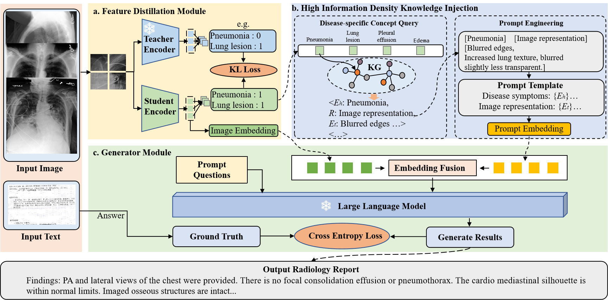

# MedKit: Multi-level Feature Distillation with Knowledge Injection for Radiology Report Generation

## Introduction

This repository contains the implementation related to our paper.
The code is currently being organized and uploaded in stages to ensure clarity and reproducibility.   We appreciate your patience and will update this repository continuously in the coming days.
